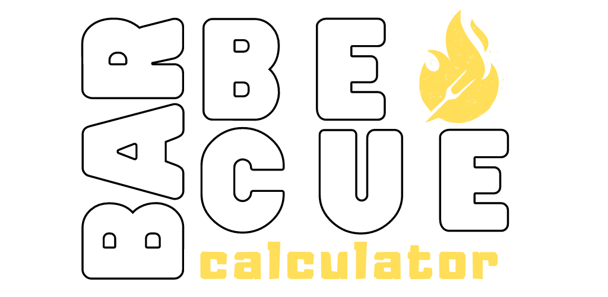

 

# Barbecue Calculator

## Descrição
As vezes fazer um **churrasco** pode ser desafiador, sabe o por quê?

* Quantos quilos de carnes você vai precisar comprar?
* Será que a bebida alcoólica vai ser suficiente?
* E o refrigerante? Vai ser suficiente? 

Algumas vezes essas dúvidas são frequentes antes de preparar um churrasco para a família ou amigos.

Entretanto, com o **Barbecue Calculator**, você vai conseguir saber a quantidade certa de bebida e comida para comprar e preparar o seu churrasco sem preocupações!

## Como utilizar a Calculadora?

Informações Necessárias para o Cálculo

* Quantidade de Pessoas;
* Quantidade de crianças;
* Quanto tempo vai durar a festa.

Errei o número de pessoas ou horas, e agora?

Após a calculadora definir a quantidade de carne, bebida alcoólica e refrigerantes, irá aparecer um botão com o nome **calcular novamente**. Você deve clicá-lo para reiniciar o programa.

## Como ver a aplicação funcionando?
[Link da calculadora](https://danilobezek.github.io/frontEndPortfolio/barbecueCalculator/)

## Novas melhorias em andamento

- [x] Quantidade de Carne
- [x] Quantidade de bebida alcoólica
- [x] Quantidade de refrigerante
- [ ] Sugestão de quais carnes comprar
- [ ] Sugestão de acompanhamentos para o churrasco
- [ ] cotação média do churrasco
    - (R$ carne + R$ bebida + R$ refrigerante)
